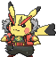

     

  # Bienvenidos a mi Pokédex! 
  
  **Hecha con mucho entusiasmo y amor. Aquí podrás encontrar todos los pokémon que tiene la base de datos pokéapi.co**

  ## Contenido
  
  La interfaz de botones contiene los tipos, las generaciones o el fantástico modo aleatorio. También podrás encontrar todos los pokémon vistos, que se irán almacenando localmente. El botón "Vistos" te los mostrará.
  
  

  
  
_Espero que disfrutes de la app, conoce sus **gritos de guerra** que tiene el juego de la antigua consola GAMEBOY y de sus **animaciones.**_
  
 

  

  
  ### [**Enjoy it! ↗**](https://conancos.github.io/mipokedex/)

**CONANCOS.DEV** 

  
